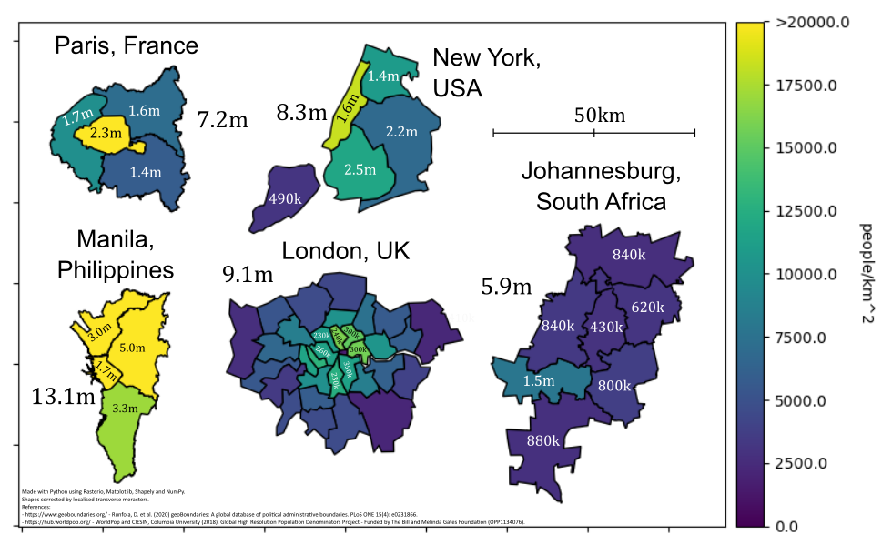
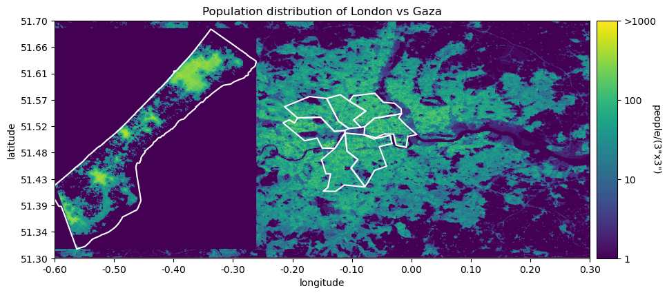

## Population distributions and densities

Population densities:

<p align="center">
  
</p>

Population distributions:

<p align="center">
  
</p>

## Set up (optional)

Create Conda environment:

```bash
conda create --name pygeo --python=3.9
```

Install packages in the requirements.txt file.

Set up Conda Kernel:
```bash
conda activate pygeo
python -m ipykernel install --user --name=pygeo
conda activate pygeo
jupyter notebook
```

Use with Jupyter Notebook:

```bash
conda activate pygeo
jupyter notebook
```

# Sources

https://www.geoboundaries.org/ 
Runfola, D. et al. (2020) geoBoundaries: A global database of political administrative boundaries. PLoS ONE 15(4): e0231866. https://doi.org/10.1371/journal.pone.0231866

https://hub.worldpop.org/
WorldPop (www.worldpop.org - School of Geography and Environmental Science, University of Southampton;
Department of Geography and Geosciences, University of Louisville; Departement de Geographie, Universite
de Namur) and Center for International Earth Science Information Network (CIESIN), Columbia University
(2018). Global High Resolution Population Denominators Project - Funded by The Bill and Melinda Gates
Foundation (OPP1134076). https://dx.doi.org/10.5258/SOTON/WP00675