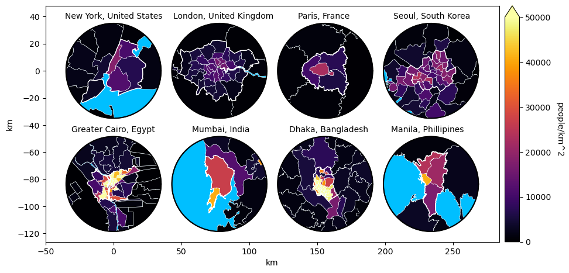
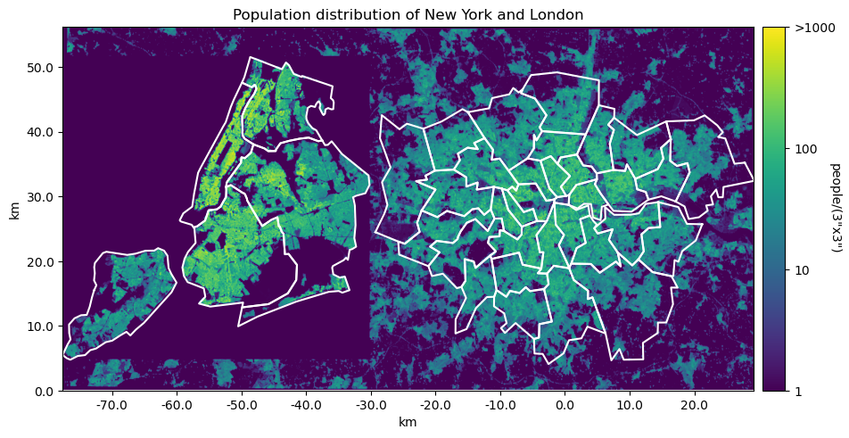
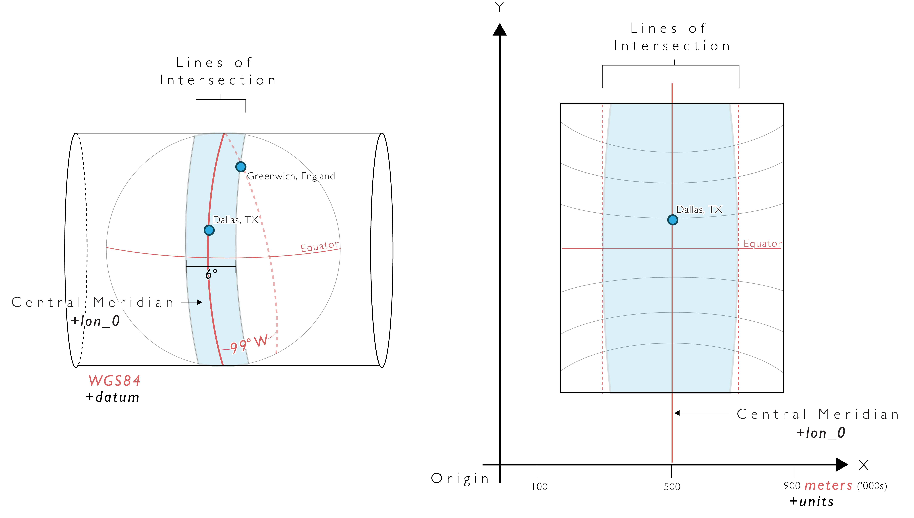

## Population distributions and densities

Population densities:

<p align="center">
  
</p>

Population distributions:

<p align="center">
  
</p>

## Projections

The input data for the most part is in WGS 1984 co-ordinates. That is, latitude and longitude on a spheroid approximation of the earth. This spheroid very closely resembles a sphere, with the z radius about 297/298 times smaller than the x and y radii. (The x and y radii are equal on a spheroid.) 

Plotting these directly results in the [equirectangular projection](https://en.wikipedia.org/wiki/Equirectangular_projection). 
This projection preserves lines of latitude but stretches apart lines of longitude.
At the extreme, the poles are stretched from a single point to a line as long as the equator.
Shapes will appear stretched in the x-direction.
This stretching factor can be calculated as `np.cos(latitude)` where `latitude` is in radians.

For small regions this can be corrected by assuming a single stretch factor e.g. for the middle line of latitude in the region of interest.

<figure align="center">
  
  <figcaption> Source: <a href="https://pygis.io/docs/d_understand_crs_codes.html">pygis.io/docs/d_understand_crs_codes.html</a>.</figcaption>
</figure>

A more robust method is to use a [transverse mercator projection](https://en.wikipedia.org/wiki/Transverse_Mercator_projection).
This wraps a cylinder around the earth. 
It then (1) projects points on to this cylinder and (2) stretches them out in both the `x` and `y` direction so that the mapping is conformal. That is, the object retains its shape.
The central longitude directly on the cylinder is fully preserved.
A third step is often added to convert this spherical projection to an ellipsoid projection.

Note that in this projection the units are not earth distances. Rather, they are earth distances multiplied by some stretch factor. However very close to the central longitude this stretch factor is approximately 1, so for a small region about it they are approximately earth distances.

## Set up (optional)

Download data to the ./data folder.

Create Conda environment:

```bash
conda create --name pygeo --python=3.9
```

Install packages in the requirements.txt file.

Set up Conda Kernel:
```bash
conda activate pygeo
python -m ipykernel install --user --name=pygeo
```

Use with Jupyter Notebook:
```bash
conda activate pygeo
jupyter notebook
```
# Data Sources

Country and administrative boundaries from https://www.geoboundaries.org/. 
> Runfola, D. et al. (2020) geoBoundaries: A global database of political administrative boundaries. PLoS ONE 15(4): e0231866. https://doi.org/10.1371/journal.pone.0231866

Country populations from https://hub.worldpop.org/geodata/listing?id=78
> WorldPop (www.worldpop.org - School of Geography and Environmental Science, University of Southampton;
Department of Geography and Geosciences, University of Louisville; Departement de Geographie, Universite
de Namur) and Center for International Earth Science Information Network (CIESIN), Columbia University
(2018). Global High Resolution Population Denominators Project - Funded by The Bill and Melinda Gates
Foundation (OPP1134076). https://dx.doi.org/10.5258/SOTON/WP00675

City of Johannesburg administrative regions from https://data.metabolismofcities.org/dashboards/johannesburg/. 
